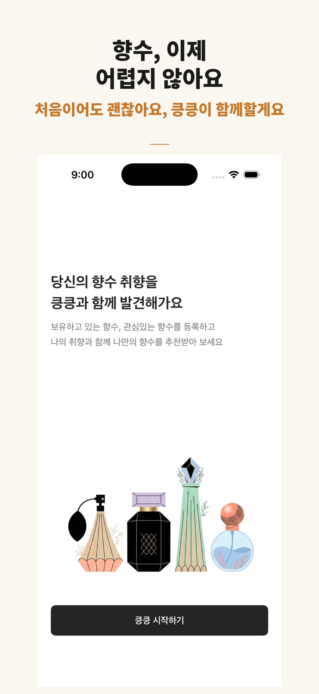
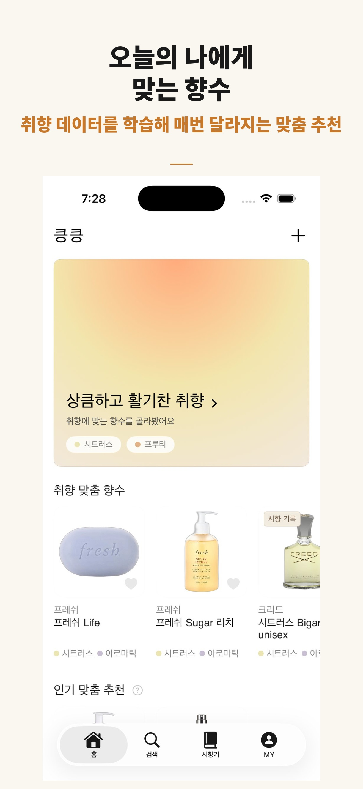
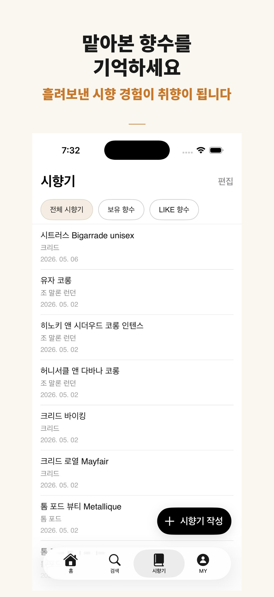
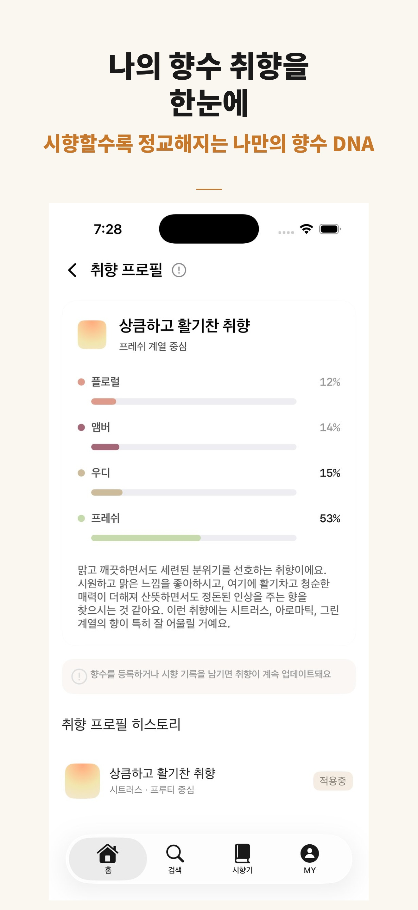

# 킁킁 (Sniff)

<p align="center">
  
</p>

킁킁은 향수를 처음 접하는 사람도 자신의 취향을 발견하고, 맡아본 향을 기록하고, 나에게 맞는 향수를 추천받을 수 있는 iOS 앱입니다.

향수에 대한 사전 지식이 없어도 온보딩 태그 선택만으로 취향을 파악하고, Gemini AI가 분석한 취향 프로필을 기반으로 개인화된 향수를 추천받을 수 있습니다. 맡아본 향수는 시향 노트로 기록하고, 보유 향수는 컬렉션으로 관리합니다.

| 개발 기간 | 팀 구성 | 배포 |
|---|---|---|
| 2026.03.31 ~ 2026.05.07 (약 6주) | iOS 2명, 디자이너 1명, 매니저 1명 | App Store 출시 완료 |

---

## 주요 기능

### 취향 분석 온보딩

향수를 몰라도 괜찮습니다. 계절, 분위기, 향 계열 등 5단계 태그 선택만으로 내 취향을 파악하고, Gemini AI가 취향 프로필을 분석해 나만의 향 정체성을 알려줍니다.

- 5단계 태그 선택으로 향수 취향 입력
- AI 취향 분석 후 취향 프로필 카드 생성
- 시향 기록이 쌓일수록 프로필이 정교해짐

### 개인화 향수 추천

취향 프로필을 기반으로 나에게 맞는 향수를 추천하고, 향수마다 추천 이유를 함께 확인할 수 있습니다.

- 취향 프로필 기반 개인화 추천
- 국내 구매 가능한 향수 우선 추천
- 향수마다 AI가 생성한 추천 이유 제공

### 시향 노트 작성 및 기록

맡아본 향수를 바로 기록할 수 있고, 인터넷이 없어도 즉시 저장됩니다.

- 향수명, 브랜드, 평점, 무드 태그, 메모 기록
- 오프라인 상태에서도 즉시 저장 및 조회
- 인터넷 연결 시 자동 동기화

### 보유 향수 컬렉션

내가 가진 향수와 좋아하는 향수를 한 곳에서 관리합니다.

- 보유 향수 등록 및 사용 기록
- LIKE 향수 저장

### 취향 프로필 히스토리

AI 재분석 결과가 쌓일수록 내 취향이 어떻게 변해왔는지 시간순으로 확인할 수 있습니다.

- 취향 재분석 요청 및 결과 저장
- 분석 히스토리 시간순 조회

---

## 화면 예시

| 온보딩 | 홈 추천 | 시향 노트 | 취향 프로필 |
|:---:|:---:|:---:|:---:|
|  |  |  |  |

---

## 기술 스택

| 기술 | 선택 이유 |
|---|---|
| SwiftUI | 선언형 UI로 화면 상태 변화를 명확하게 관리하기 위해 선택 |
| UIKit | SwiftUI로 구현하기 어려운 UICollectionView 기반 레이아웃에 보완적으로 사용 |
| RxSwift | 보유 향수·LIKE 향수·시향 노트 등 여러 상태를 한 화면에서 실시간으로 반영하기 위해 선택 |
| Swift Concurrency (async/await) | 회원 탈퇴처럼 실행 순서가 반드시 보장돼야 하는 비동기 작업에 선택 |
| CoreData | 오프라인 상태에서도 시향 노트를 즉시 저장·조회하기 위해 선택 |
| Firebase Firestore | 기기를 교체해도 데이터가 유지되도록 원격 백업 저장소로 선택 |
| Firebase Auth | Apple·Google 소셜 로그인과 보안 규칙 기반 데이터 접근 제어를 위해 선택 |
| Gemini API | 사용자 시향 기록 기반 취향 분석 및 자연어 추천 이유 생성을 위해 선택 |
| Fragella API | 74,000+개 향수 데이터베이스 제공, 국내 브랜드 한국어 매핑 테이블 직접 구축 |
| Kingfisher | 향수 이미지 비동기 로딩 및 캐싱으로 스크롤 성능 유지 |
| Lottie | 로딩 및 온보딩 애니메이션 구현 |

---

## 기술적 의사결정

### CoreData + Firestore 이중 저장 구조

**문제**: 오프라인에서도 시향 노트를 읽고 써야 하고, 기기를 교체해도 데이터가 유지돼야 한다.

**선택지 비교**
- Firestore만 사용: 네트워크 없을 때 데이터를 볼 수 없음
- CoreData만 사용: 기기 교체 시 데이터 유실

**선택**: CoreData를 1차 저장소로, Firestore를 원격 백업으로 사용하는 오프라인 우선(Offline-first) 구조

각 노트에 `syncStatus`(pending / synced / failed / pendingDelete)를 부여해 네트워크 없이도 즉시 저장·조회하고, 연결 복구 시 자동 동기화합니다.

### RxSwift + Swift Concurrency 혼용

**문제**: 화면마다 비동기 처리 요구사항이 달라 하나의 패러다임으로 통일하기 어렵다.

**선택지 비교**
- RxSwift만 사용: 순서 보장이 필요한 회원 탈퇴 로직이 복잡해짐
- async/await만 사용: 마이페이지처럼 다중 상태를 실시간 반영하는 화면이 불편함

**선택**: 다중 상태 실시간 반영은 RxSwift, 순서 보장이 필요한 인증·탈퇴는 async/await 혼용

두 패러다임이 만나는 경계에서 타입 불일치가 발생하는 것을 막기 위해 `Single.async()` 브릿지 익스텐션을 직접 구현했습니다.

### 회원 탈퇴 순서 — Firestore 삭제 → Auth 삭제

**문제**: 회원 탈퇴 후 Firestore에 사용자 데이터가 잔류하는 문제 발생

**원인**: Auth를 먼저 삭제하면 Firestore 보안 규칙상 접근 권한이 즉시 소멸되어 이후 Firestore 데이터 삭제 불가

**선택**: Firestore 3개 컬렉션 완전 삭제 후 Auth 계정 삭제. async/await으로 순서를 코드 레벨에서 보장 → 탈퇴 시 잔류 데이터 0건 달성

---

## 아키텍처

View에 데이터 조회·상태 관리·비즈니스 로직이 집중되는 것을 막기 위해 MVVM 패턴을 기반으로 Presentation / Domain / Data 3개 레이어로 책임을 분리했습니다.

```
Presentation (화면 담당)
└── View: 화면 표시, 사용자 입력 처리
└── ViewModel: 화면 상태 관리, 사용자 액션 처리

Domain (비즈니스 로직 담당)
└── Repository 프로토콜: 데이터 접근 방식 추상화
└── 도메인 모델: TastingNote, Perfume 등

Data (데이터 저장 담당)
└── CoreData: 로컬 저장 구현체
└── Firestore: 원격 저장 구현체
```

**DI(의존성 주입)**: AppDependencyContainer + SceneFactory 패턴으로 ViewModel이 구체 구현체가 아닌 프로토콜에만 의존하도록 설계했습니다. Firebase를 다른 저장소로 교체해도 ViewModel 코드를 수정할 필요가 없습니다.

---

## 폴더 구조

```
Sniff
├── App
│   ├── AppDependencyContainer.swift   # DI 컨테이너
│   └── AppStateManager.swift          # 인증 상태 관리
├── Presentation
│   ├── Login
│   ├── Onboarding
│   ├── Home
│   ├── Search
│   ├── TastingNote
│   ├── MyPage
│   └── Settings
├── Domain
│   ├── Models
│   └── Repositories (프로토콜)
└── Data
    ├── Local (CoreData)
    └── Remote (Firestore, Gemini, Fragella)
```

---

## 관련 링크

- [킁킁 App Store 링크](https://apps.apple.com/kr/app/%ED%82%81%ED%82%81-%ED%96%A5%EC%88%98-%EC%B6%94%EC%B2%9C-%ED%94%8C%EB%9E%AB%ED%8F%BC/id6763529466)
- [킁킁 브로셔 Notion 링크](https://www.notion.so/teamsparta/iOS-9-34f2dc3ef51481a68e39e55d5a2d3488)

---

## 향후 개선 계획

- 다른 사용자 리뷰 기능 추가
- 향수 구매 링크 연결로 추천에서 구매까지 흐름 완성
- 커뮤니티 기능 도입으로 취향이 비슷한 사용자 간 향수 공유
- 향수 추천 히스토리 제공

---

## 빌드를 위해 필요한 항목

이 프로젝트는 외부 API Key가 필요합니다.
프로젝트 루트에 `Config.xcconfig` 파일을 생성하고 아래 값을 입력합니다.

```text
GEMINI_API_KEY=your_gemini_api_key
FRAGELLA_API_KEY=your_fragella_api_key
```

Firebase 연동을 위해 `GoogleService-Info.plist`를 프로젝트에 추가해야 합니다.
